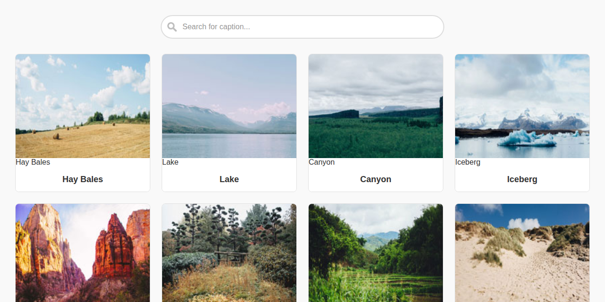

# Interactive Photo Gallery

> A responsive photo gallery with real-time search filtering and lightbox viewing, built with vanilla JavaScript.

[](https://brianwalkerdev.github.io/interactive-image-gallery-js/)
[](LICENSE)

## 📸 Overview

An elegant photo gallery showcasing 12 landscape images with instant search filtering and full-screen lightbox viewing. Demonstrates clean JavaScript DOM manipulation, responsive CSS Grid, and accessibility best practices.

**[View Live Demo →](https://brianwalkerdev.github.io/interactive-image-gallery-js/)**

## ✨ Features

- **Real-time Search** – Filter photos instantly by caption or title
- **Lightbox Viewer** – Click any image to view in full-screen modal with navigation
- **Responsive Design** – Adapts seamlessly from mobile to desktop
- **Keyboard Navigation** – Full keyboard support for accessibility
- **Smooth Animations** – Polished hover effects and transitions

## 🛠️ Tech Stack

- **HTML5** – Semantic markup with accessibility features
- **CSS3** – Responsive Grid layout with modern styling
- **JavaScript (ES6+)** – Vanilla JS with DOM manipulation
- **BaguetteBox.js** – Lightweight lightbox library

## 🚀 Installation & Usage

### Local Development

```bash
# Clone the repository
git clone https://github.com/brianwalkerdev/interactive-image-gallery-js.git
cd interactive-image-gallery-js

# Install dependencies
npm install

# Start local server (opens at http://localhost:8080)
npm start
```

### Build for Production

```bash
# Create static build in dist/ folder
npm run build
```

The `dist/` folder contains all static files ready for deployment.

## 📦 Deployment

This project is deployment-ready for static hosting platforms:

### GitHub Pages
1. Push your code to GitHub
2. Go to **Settings** → **Pages**
3. Select branch and `/root` or `/dist` folder
4. Save and access your site at `https://yourusername.github.io/repo-name/`

### Netlify
1. Drag and drop the `dist/` folder into [Netlify Drop](https://app.netlify.com/drop)
2. Or connect your GitHub repo for automatic deployments

### Vercel
```bash
npm install -g vercel
vercel --prod
```

## 📂 Project Structure

```
interactive-image-gallery-js/
├── css/
│   ├── normalize.css      # CSS reset
│   └── styles.css          # Main styles
├── js/
│   └── search.js           # Search filter logic
├── photos/
│   ├── thumbnails/         # Thumbnail images
│   └── *.jpg               # Full-size images
├── index.html              # Main HTML file
├── package.json            # Project metadata
├── build.js                # Build script
└── LICENSE                 # MIT License
```

## 🖼️ Screenshot


*Clean, responsive interface with search and lightbox functionality*

## 📄 License

This project is licensed under the MIT License - see the [LICENSE](LICENSE) file for details.

## 👨‍💻 Author

**Brian Walker**  
Portfolio: [brianwalker.dev](https://brianwalker.dev)  
GitHub: [@brianwalkerdev](https://github.com/brianwalkerdev)

---

*Built as a portfolio project demonstrating vanilla JavaScript skills and modern web development practices.*
